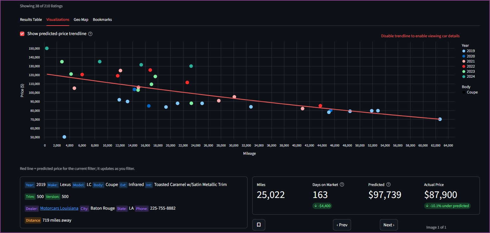
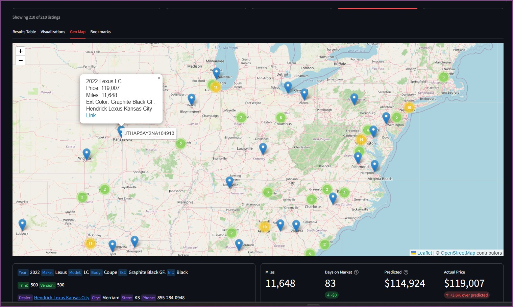
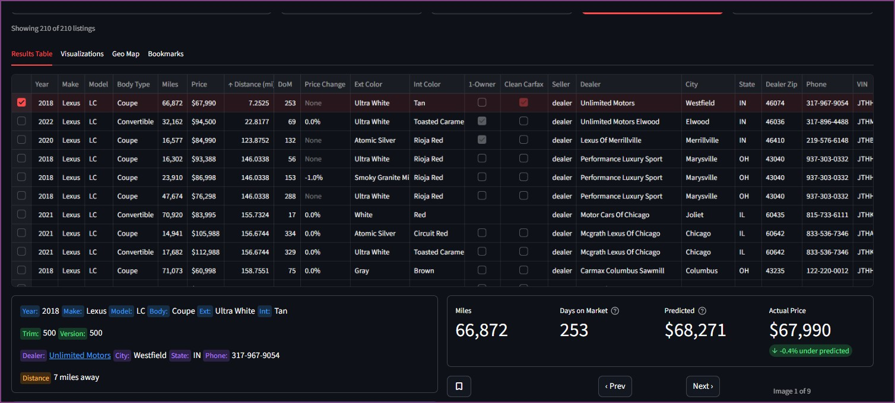
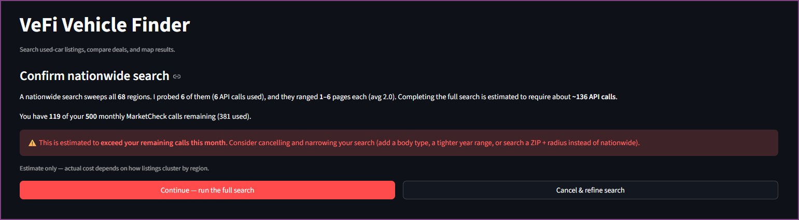

<!-- SPDX-License-Identifier: GPL-3.0-or-later -->
<p align="center">
  
</p>

<h1 align="center">VeFi — Vehicle Finder</h1>

<p align="center">
  Find the real deals faster.
</p>

<p align="center">
  <a href="LICENSE"></a>
  
  
</p>

VeFi is an open-source used-car search and analysis tool built to use the [MarketCheck](https://www.marketcheck.com/)
API. 

VeFi fills some very specific gaps in the car shopping experience for people that 
are shopping for special cars.  

When you shop on any of the major car listing sites, after some time you begin
to realize that the experience is actually designed to benefit the
dealerships paying for listings, not the consumer. If you've ever
copy-pasted details out of cartrader, carguru, truecar, etc., into a spreadsheet
so you could actually compare apples to apples, VeFi might be useful to you. 

## Here's information VeFi gives you that the car listing sites don't
When you search for cars in VeFi,you get back everything you need to compare cars 
based on the data that matters for **your** search --summarized, organized, and 
easily digested.

### The Price/Mile graph
Cars with less miles are worth more. But how much more?  VeFi plots every car
on a Price/Miles graph and shows you the trendline that instantly reveals whether
cars are above or below that trendline. 

The trendline is simplistic; it doesn't factor in features, colors, etc. --just
price and miles. But its simplicity is powerful: The trendline recalculates with 
every filter you apply.  If you are only shopping for Volvo V60s with the Ultra 
package in only 3 colors, you can filter to those and see the trendline.  

<table>
  <tr>
    <td width="50%">
      <br>
      <em>Price/Miles graphing and pricing trendline</em>
    </td>
  </tr>
</table>  

The trendline predicted price is also displayed in each listing's header. 
If a car is under or over the predicted price, you know by exactly how much. 

### The Geo Map
Eventually you are going venture out in the physical world of dealership lots, 
and VeFi puts every car you search for on a super-responsive map you can navigate.

<table>
  <tr>
    <td width="50%">
      <br>
      <em>Easily view cars by physical location</em>
    </td>
  </tr>
</table>  

And make sure to input your ZIP Code in the filter criteria, even if you don't
want to restrict to a distance.  By entering your ZIP, a straight-line distance is
calculated so you can sort and prioritize cars by distance.

### The Results table
It's the most basic thing really. Put all the car details in a compact table to sort
through. This is a lot more efficient than browsing page after page of horrible pictures 
with minimal data.  

<table>
  <tr>
    <td width="50%">
      <br>
      <em>Information-dense table view for quick identification of good cars</em>
    </td>
  </tr>
</table>  

### The Bookmarks
When you do find cars that make the initial cut, bookmark them to the bookmarks tab. 
Both the main results table and bookmarks table let you export to .csv and
import to your spreadsheet of choice. 


### Some other useful things VeFi helps with
- Every listing has the dealer's URL linked, so you can always jump right to the 
  dealership's webpage.  Phone number is there too, if you need to call them.
- Actual option codes are available for most cars, decoded from the VIN. If you're
  looking for the Mark Levinson or Bowers and Wilkins audio options, or a specific
  suspension package, you can't really rely on dealer listings.
- VeFi also gives you a few "insider" pieces of information that listings often
  don't mention:  Days on market and amount reduced since originally listed. 
  Useful to know if the car you want is one the dealership considers "lot rot"
  (aged unit) that they can't wait to get rid of. 
- Immediate visibility of "single owner" and "clean carfax" cars.  Neither of these
  attributes guarantee a good car, but can help you identify what to look into. 
  

### One thing VeFi specifically DOESN'T give you
- No sponsored results cluttering your sorted list.  VeFi is just the raw data,
  presented cleanly.


## "Sounds pretty useful. What's the catch?"
There is a catch. VeFi uses the MarketCheck API. The lowest paid tier for that 
API is $300/month, plus sub-penny usage fees per API call.  That pricing is 
completely unrealistic for single-purchase consumer car shopping.

But MarketCheck DOES have a free tier:  500 API calls per month.  That's enough
for effective use, if you are careful. 

VeFi is designed to help you be careful.

### Close tracking of API calls
When you input your MarketCheck API key, you will also see your call quota of 500 calls. 
Every call VeFi makes to MarketCheck is tracked so you can monitor your remaining capacity.

#### Nationwide searches
Nationwide searches deserve more detailed explanation.  MarketCheck doesn't offer 
the ability to do  a nationwide search in one call for the free tier, so VeFi uses
a geographically distributed set of Lat/Long coordinates with a 100 mile radius 
spacing to cover the US.  There are 68 unique points that are queried, so any nationwide
search will consume at least 68 of your 500 calls. 

68 calls is just where a nationwide search starts. If a single query has more than 50 matching 
car listings, then results are paginated and require extra calls. A search in a dense 
L.A. area / might generate 250 results, which is 5 calls for that one area.

Finally, an extra 6 calls are made up front on each national search to sample 6 representative
regions.  VeFi estimates the total number of calls required to search nationwide 
based on the number of results returned in the sample.  You can either accept or cancel 
the search to refine your criteria more narrowly. 

<table>
  <tr>
    <td width="50%">
      <br>
      <em>Strict API quota tracking</em>
    </td>
  </tr>
</table>  

The bottom line is that if you are searching for the best deal on a 2000-2010 Camry
nationwide, then VeFi isn't the tool for you. You will get 100s of listings in every
ZIP code and exhaust your entire monthly quota before covering even 1/2
the country.  On the other hand, if you are searching for an Alfa Giulia, you can search n
ationwide and will likely use the minimum number of calls possible for a nationwide search.  

#### Pictures don't consume API calls. 
The pictures you can browse are direct links to the dealership-hosted listing, so
you don't use API calls to browse pictures. 

#### Listing details and option packages
Every listing has the option to pull back 2 additional sets of information.  The first
is the dealer listing details that include the 'narrative' written by the dealership
and the features they list.  

The second is actually decoding the VIN to determine what options were ordered on
the car.  

For every listing you view, you will have the option to pull back this information if
you want, consuming extra API calls. Once you pull it back once, it is cached on your
machine. 

### Saved searches
When you spend precious API calls on a search, VeFi lets you save those
results.  Once saved you can reload them again to analyze further without spending more
API calls.  Of course you will only get new listings by doing new searches.  

### Make/Model drop downs
The MarketCheck API does not accept "close enough" when inputting make/model names.  Querying
MarketCheck to get back the canonical list of makes and models does also require API calls. 
This project contains valid make models as of August 2026, however if you use VeFi over time
you will need to refresh the data to pick up new vehicles to market.  This can be done
from the Settings tab. 

## Requirements

- Python 3.9+
- A **free MarketCheck API key** — sign up at
  [marketcheck.com](https://www.marketcheck.com/).

## Install & run

```bash
git clone <your-fork-url> vefi
cd vefi
python -m venv .venv
# Windows:  .venv\Scripts\activate
# macOS/Linux:  source .venv/bin/activate
pip install -r requirements.txt
streamlit run app.py
```

The app opens in your browser. On first launch it will prompt you for your
MarketCheck key — paste it into **Settings**, save, and start searching.

## A bit of backstory on this project and what you can expect going forward

VeFi started as a personal exercise to learn Python. At that time LLMs were just chat
boxes on webpages, so I developed it interactively with AI acting as a sort of stack
overflow tech support resource.   

Eventually the functionality got to a state that VeFi actually assisted in my own 
car purchase. All the core functionality was there but it required a lot of fiddling.
To save a search you had to manually rename files. API keys were hardcoded into 
the Python script. There was no drop down for make/model, so you had to get it 
right or waste API calls on typos.  

Sadly, my skill with AI has increased faster than my Python coding skills.  I finally
decided it was time to clean this up to the state that other might conceivable be
able to get it running and get some value, and this included heavy use of 
Claude Code Opus 4.8 to refactor the one massive script into a more traditional project
layout.  

I don't have any grand plans for this moving forward. I'm just putting it out there for 
people to use, or not use, or build on top of, or not.  


## License

VeFi is licensed under the **GNU General Public License v3.0** — see
[`LICENSE`](LICENSE). You're free to use, modify, and share it, including
commercially; derivative works must also be released under the GPL.

MarketCheck and the U.S. Census geocoder are third-party services subject to
their own terms.
